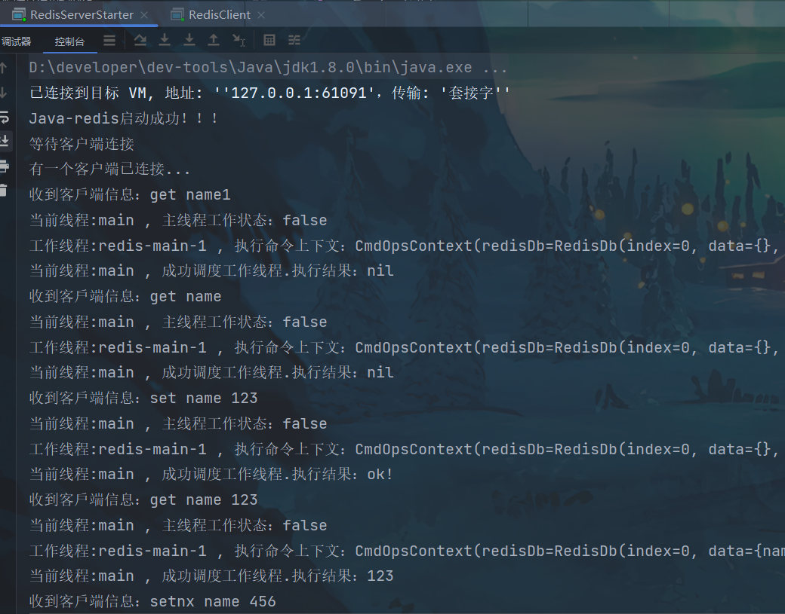
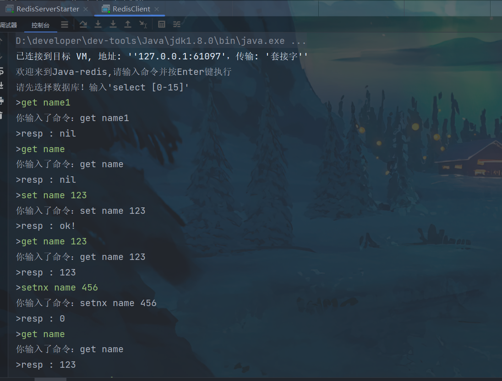
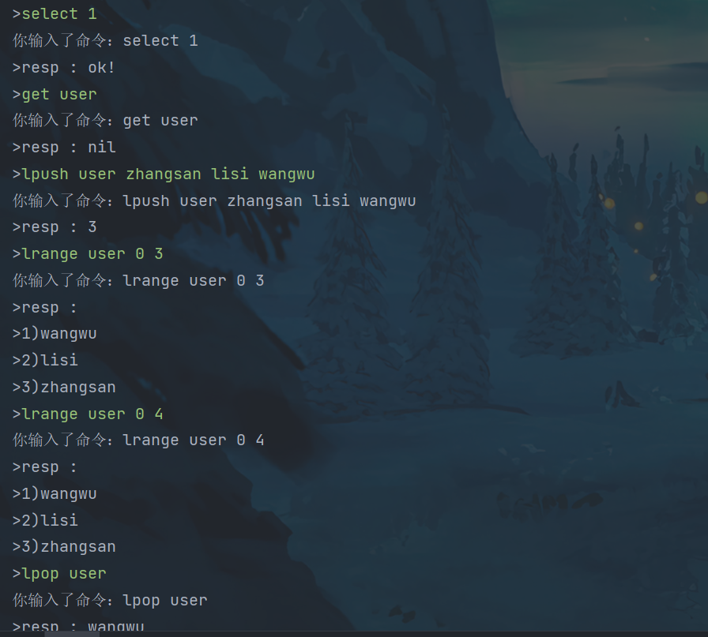

# java-redis

#### 项目介绍
java-redis是基于纯java语言实现的一个仿redis的缓存数据库，不依赖任何第三方框架。具有NoSQL的一般功能特性，同时兼容redis常用的命令。提供基于控制台的数据访问能力。

开发该项目主要初衷是用来学习redis命令和巩固java基础知识，学习该项目适合有一定java基础的朋友。欢迎有想法的朋友提供建议，一起学习。

#### 项目技术要点
1. 设计模式
2. 网络编程
3. redis命令

#### 使用说明

1.  首次启动项目,需要安装maven依赖 ``maven clean install``。
2.  找到Redis服务器启动类, `com.borened.redis.RedisServerStarter.main`,点击启动。
3.  找到Redis客户端启动类，`com.borened.redis.RedisClientStarter.main`，点击启动。
4.  在控制台随意输入redis命令，就可以开心的玩耍啦。。。

#### 运行截图

Server端

Client端（主要在客户端进行redis命令测试，目前适配了五大数据类型和key常用的命令。）

#### 参与贡献
欢迎各位有兴趣的朋友一起参与贡献，欢迎提交PR。
1.  Fork 本仓库
2.  新建 Feat_xxx 分支
3.  提交代码
4.  新建 Pull Request

#### 未来计划 TODO LIST

1. 对redis 80%以上的常用命令的覆盖支持。❎
2. 优化客户端连接的方式。❎
3. 完善服务器监控信息。❎
4. 支持磁盘数据内存回放/aof,rdb模式。❎
5. 生产级别的可执行文件打包发布。❎
6. 集群模式支持。❎